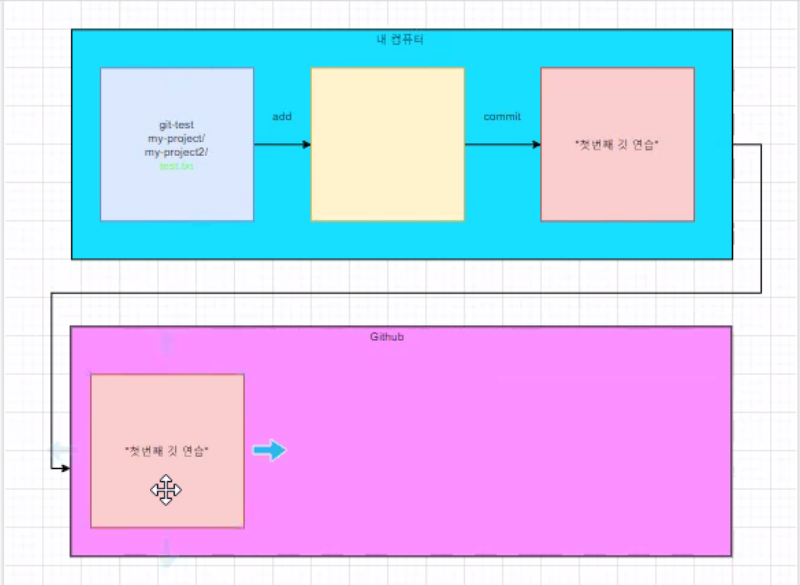

# linux 기초 문법

Typora 기능을 먼저알아보자 - 본문 버튼누르면 다 나와있습니다.
(기본적으로 jupyter notebook과 비슷한것 같다)

linux에서 사용가능한 기본 문법을 정리합니다.


## 현재 폴더 위치

- pwd (print working directory)

``` shell
$ pwd
```


## 폴더 변경

- ch (change directory)

``` shell
$ cd <이동하고싶은 폴더 이름>
```


## 현재 폴더에 있는 리스트 확인(폴더, 파일 출력)

- ls (list)
  - `-a` 옵션을 추가해주면 숨김파일까지 출력해준다.

``` shell
$ ls -a
# -a 옵션은 숨김파일까지 출력해준다.
```


## 파일 생성

- touch

``` shell
$ touch <생성할 파일 이름>
```


## 파일 삭제

- rm
  - 만약 폴더를 삭제하고 싶다면 `-r` 옵션을 추가해서 삭제 가능

``` shell
$ rm <삭제하고싶은 파일 이름>
```





### Ctrl + "/" 를 눌러주면 원래 코드를 볼 수 있다 !

